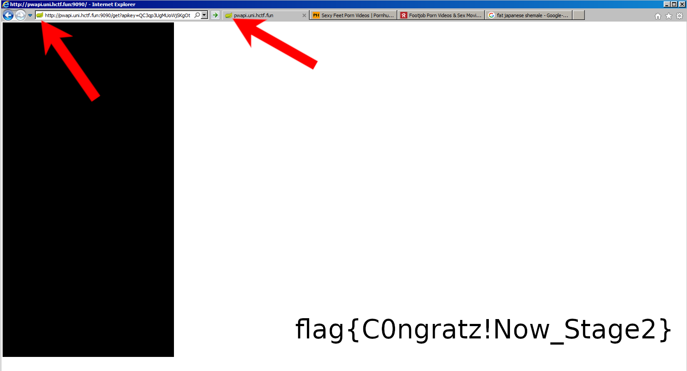

# P.W.N CTF
> 時間：2018/10/27 02:18 ~ 2018/10/29 02:18 (UTC+8)
剛好碰上期中考前，孤軍奮戰了一整天，只解出五題 T.T

## Semester 1
### PW API Stage 1
misc|frsc
> Prof. Hackevoll always forgets his passwords. Thats why he wrote himself a password storage API...
> He also used a self developed ticketing system.
> It got so spammed that he doesn't use it anymore.
> Maybe you can still find something useful in the database dump I found.

從壓縮檔解壓縮出`tickets.sql`，一開始看到還不知道要用甚麼開，先丟去Sublimeㄅ～
映入眼簾的是熟悉的SQL語句，和一堆16進位的字串，整個傻眼...
看了好一陣子，突然覺得那些16進位的字串有些玄機
```
...
INSERT INTO `attachments` (`id`, `ticket_id`, `atachment`) VALUES
(0, 230, 0x89504e470d0a1a...
(1, 1498, 0xffd8ffe000104a...
(2, 669, 0xffd8ffe000104a...
(3, 902, 0x89504e470d0a1a...
(4, 1659, 0xffd8ffe000104a...
...
```

這不是`PNG`和`JPG`的樣子嗎！於是隨便拿一組出來...


真的是圖耶！一不作二不休，把所有的圖片還原吧！
```python
def dumpImage(name, b):
    if '0xffd8ffe0' in b:
        name += '.jpg'

    elif '0x89504e47' in b:
        name += '.png'
    else:
        return

    b = bytes.fromhex(b[2:])

    with open(name, 'wb') as f:
        f.write(b)

# 事先把那幾行抓出來整理一下，存成 imgs.txt
with open('imgs.txt', 'r') as f:
    imgs = f.read().split('\n')

for image in imgs:
    image = image.split(', ')
    dumpImage(image[0] + '_' + image[1], image[2])

```

其中一張圖片果然就藏著flag



那個分頁標籤...出題者忘記自己在出題了嗎

`flag{C0ngratz!Now_Stage2}`

## Semester 3
